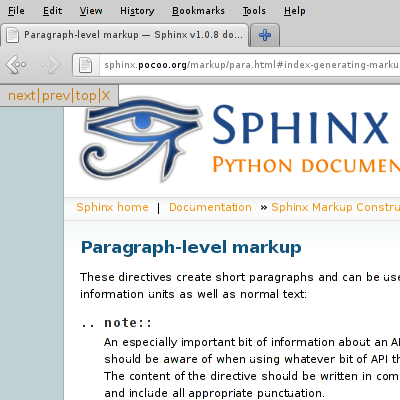
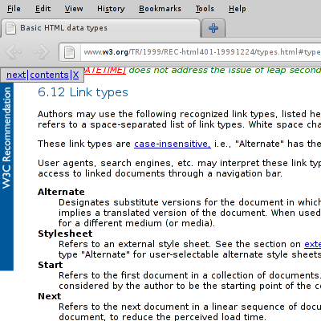

===================================
HTML Navigation toolbar for Firefox
===================================

What is it?
===========

This is a Firefox extension which provides a small toolbar to navigate throught
a website, on websites that provide the right "link types", as described in the
`link types section`_ of the HTML 4 specifications.

This is useful if you are browsing documentation, such as those produced by the
`Sphinx`_ documentation project or on the `W3C documentation
pages <http://www.w3.org/TR/html/>`_ itself, for example.

How to install?
---------------

`Install HTML navigation toolbar`_ (you may need to authorize your web browser to install
from this website). Note that you will need *Firefox 4.0 or more* for this
extension to work.

I don't understand, what does it do exactly?
============================================

Basically, if the webpage provides the necessary information,
you will have a small frame on the top left of your page, which
allows to navigate through the website.

Examples
--------

If the toolbar bothers you for a particular page, you can click
the ``X`` button to close it.

My websites already have this kind of navigation links, isn't this extension useless?
=====================================================================================

On some websites, like those generated by `Sphinx`_, you may already find this
kind of navigation link, directly embedded into the webpage.

However, they are usually not as accessible as this toolbar, which always stays
at the top of your document and always at the same position.

Technical details
=================

HTML navigation toolbar is developed using the `Addon SDK`_ (formerly Jetpack).
You can access the source code in the `Git repository`_ (or the `mirror on
Github <https://github.com/multani/jetpack-html-navigation/>`_).

If you want to contact the author, just send an email at
`jon+jetpack-html-navigation@multani.info`_.

.. _link types section: http://www.w3.org/TR/1999/REC-html401-19991224/types.html#type-links
.. _Sphinx: http://sphinx.pocoo.org/
.. _Install HTML navigation toolbar: http://multani.info/projects/jetpack-html-navigation/releases/jetpack-html-navigation-0.2.xpi
.. _Addon SDK: https://addons.mozilla.org/en-US/developers/
.. _Git repository: http://multani.info/projects/git/?p=jetpack-html-navigation.git;a=summary
.. _jon+jetpack-html-navigation@multani.info: mailto:jon+jetpack-html-navigation@multani.info

